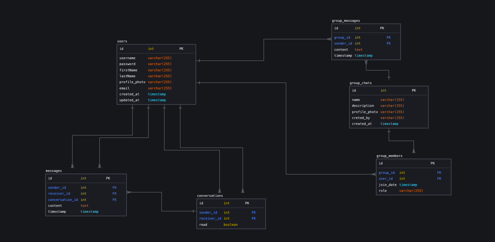

# Chatie Talkie

Introducing Chatie Talkie, the ultimate chat application designed to connect like-minded individuals who share a passion for travel and live music. Whether you're an adventurous soul seeking travel buddies or a music enthusiast in search of concert companions, Chatie Talkie is your go-to platform for forging new friendships and creating unforgettable experiences.

## Tech Stack

<p float="left" style="display: flex; justify-content: space-around; ">


</p>

## Entity Relational Diagram



## Database Configuration

First of all, you have to create your database first:

```
npx sequelize-cli db:create
```

Second of all, you have to migrate the database:

```
npx sequelize-cli db:migrate
```

Now, you're good to go!

## How to run it locally (Development mode)

Clone the project:

```
git clone https://github.com/fixmannn/chatie-talkie.git
```

Go to the project directory:

```
cd chatie-talkie
```

Install dependencies:

```
npm install
```

Start the server:

```
npm run start
```

## Postman collection

Here is the postman collection and environment if you need to run the API using postman -> [Environment & Collection](https://drive.google.com/drive/folders/1XMzWqUk7Ke1JGud7UUofOUHg8IiZGnS_?usp=share_link)

# API Endpoint

| Method | Endpoint                                        | Description                       |
| ------ | ----------------------------------------------- | --------------------------------- |
|        | **User Management**                             |                                   |
| POST   | /api/signup                                     | Create user account               |
| POST   | /api/login                                      | User login                        |
| POST   | /api/logout                                     | User logout                       |
| GET    | /api/account                                    | Get user account information      |
| PATCH  | /api/change-password                            | Change user account password      |
| PATCH  | /api/profile/update                             | Update user account information   |
| DELETE | /api/account/delete                             | Delete user account               |
|        |                                                 |                                   |
|        | **Personal chat**                               |                                   |
| GET    | /api/chats                                      | Get all conversations             |
| GET    | /api/chats/{id}                                 | Get conversation by id            |
| POST   | /api/chats                                      | Send message to a user            |
| DELETE | /api/chats/{id}                                 | Delete conversation               |
| DELETE | /api/chats/{id}/message?id={value}              | Delete message by id              |
|        |                                                 |                                   |
|        | **Multimedia messaging**                        |                                   |
| GET    | /api/chats/{id}/multimedia                      | Get all multimedia messages       |
| GET    | /api/chats/{id}/multimedia/file?content={value} | Get multimedia message (per item) |
|        |                                                 |                                   |
|        | **User Profile**                                |                                   |
| GET    | /api/profile/{id}                               | Get user profile                  |
|        |                                                 |                                   |
|        | **Group Chat**                                  |                                   |
| POST   | /api/create-group                               | Create group chat                 |
| POST   | /api/group/{id}/chats                           | Send message to a group           |
| POST   | /api/group/{id}/members/add/{user_id}           | Add member to a group             |
| GET    | /api/group/{id}/chats                           | Get group chats                   |
| GET    | /api/group/{id}/members                         | Get group members                 |
| PATCH  | /api/group/{id}/members/role/{user_id}          | Set role to member                |
| DELETE | /api/group/{id}/members/{user_id}               | Remove member from a group        |
| DELETE | /api/group/{id}/chats?message_id={value}        | Delete message from a group       |
